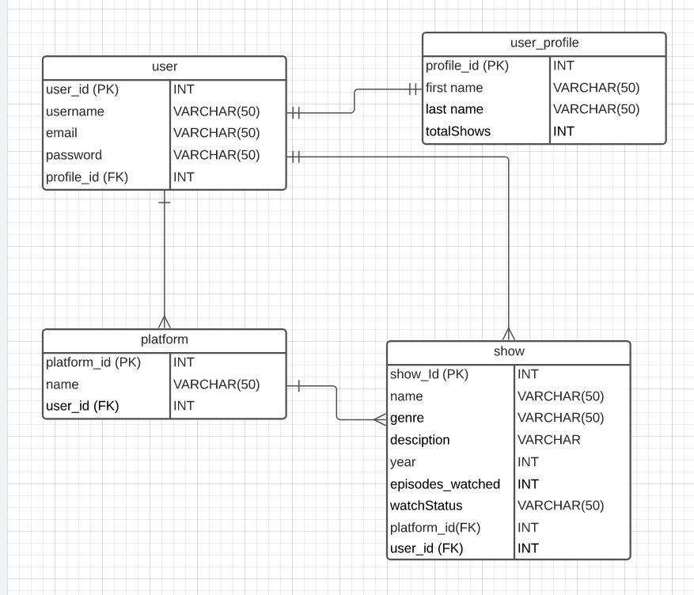
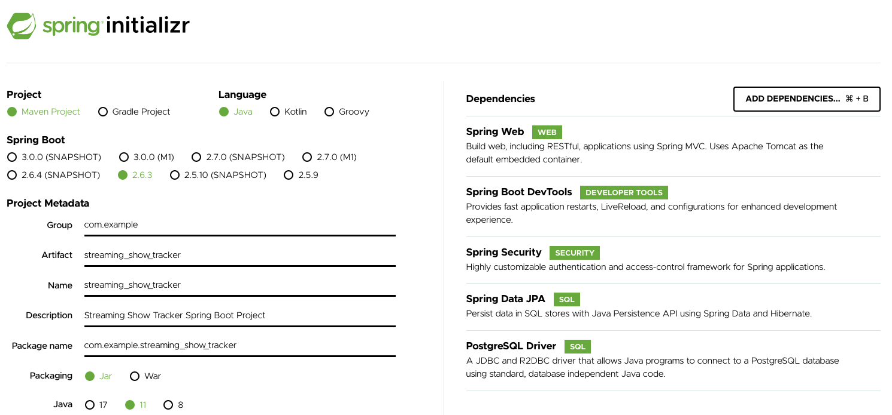
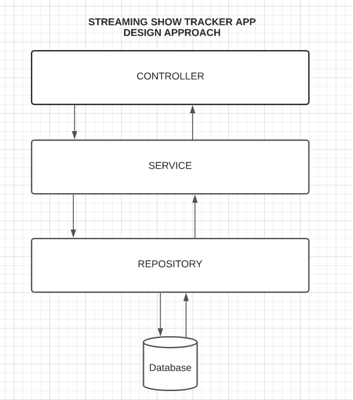

# **Streaming TV Show Tracker**

## OBJECTIVE
The goal of this project was to create a simple REST API that would allow a user to track shows from different streaming platforms that they are watching, have watched, or plan to watch. This API would be built using Java, Spring Boot, and PostgreSQL.
### TOOLS AND TECHNOLOGIES USED
**DESIGN**
- LUCID CHART

**CODE**
- JAVA
- SPRING BOOT
- SPRING DATA
- SPRING SECURITY
- MAVEN
- INTELLIJ IDEA
- JWT TOKENS

**DATABASE**
- POSTMAN

- POSTGRESQL

## THE PLAN
I planned for this application to follow the MVC design, while also utilizing the Repository-Service Pattern. This meant that the REST API would be split into layers,
with the Repository layer responsible for handling database interaction, the Service layer utilizing information retrieved from the Repository layer through Dependency Injection to manage the logic. The Controller would be responsible for mapping the CRUD operations.

Following this pattern ensured that the application was adequately decoupled and following the Single Responsibility Principle.
### ERD DIAGRAM

### POM DEPENDENCIES

### LAYERED DESIGN APPROACH

## THE PROCESS
After planning out the individual table entities and their relationships, I created the skeleton of my Spring Boot application, adding all necessary dependencies. I created several Java Model classes in my project that would become the base for constructing the entity tables in my database. I decided earlier on that I wanted to utilize Spring Boot Web Security and JWT tokens, so I began working on those classes before moving on to the Service and Repository layers.

I completed the Service, Repository, and Controller for each individual table–testing the endpoints with PostMan–before moving on to the next. Breaking down the endpoint testing into segments helped me ensure that I wasn’t making any huge oversights in the Service layer logic or Controller mapping.

Since this app would focus on tracking shows specifically from streaming platforms, my design centered around the Platform and Show table having a dependent relationship. In order for a show to be created it would have to be under the umbrella of a platform. One platform could have multiple shows, but a show could only be mapped to that one platform. While this is not necessarily true to the reality of all streaming services (as one show could very well be licensed by multiple platforms) I decided to prioritize practicality and simplicity in making this design. Additionally, if a platform is deleted from the app, all shows under the umbrella of that platform would also be removed.

## CHALLENGES
A ran into an issue while trying to modify my JSON output to return the name of the platform that a show was added under. I did not want to add an additional field to my Show table that would have the Platform Name, as there could be inconsistencies that could arise with having redundant data in both the Show and Platform tables.

After much research, I learned about the @Transient annotation that would allow me to include a field variable in my Show model class, without the Spring application using it to create an additional field in my table. Using the Autowired Platform model, I was able to have this variable retrieve the name of the platform associated with the individual Show Object and return it with the JSON response.

## STRETCH
To ensure that I had a firm understanding of path creation, HTTP Method Mapping, and accurately utilzing JPARespository methods, I decided to create a variety of get endpoints that used either name or id to get back items back from the database.

## UNFINISHED
- Creating endpoints for User Profile

## USER STORIES -
                                                              
### PLATFORMS
**Post:**

As a user, I should be able to create a platform.
    
**Acceptance Criteria:**

- Given that I know the name of the platform I would like to create...
- When I send a request to the server to create the platform...
- The platform will be saved into the database under my user id and be available for me to see and save shows under.

**Get:**

As a user, I should be able to view a platform I have created and view all platforms I have created.

**Acceptance Criteria:**

- Given that I have created at least one platform under my account...
- When I send a request to the server to fetch a single platform, or all platforms I have created...
- I should receive a list displaying those platforms as output, in accordance with my request.

**Put:**

As a user, I should be able to update a platform I have created.

Given that I have selected a platform that I have previously created on my account
When I change the name for that platform and send a request to the server
The name for that platform should be modified to match what I changed it to

**Delete:**

As a user, I should be able to delete a platform I have created.

**Acceptance Criteria:**

- Given that I have selected a platform that I have previously created on my account...
- When I choose to make a request to the server to delete this platform...
- It should be removed completely from my account and the database.

### SHOWS
**Post:**

As a user, I should be able to create a show as well as include details of that show such as the genre, description, year created, watch-status, etc.

**Acceptance Criteria:**

- Given that I have chosen which platform this show will be created under...
- When I send a request to the server to create the show...
- The show, and all details included, will be saved into the database under my user id and be available for me to see.

**Get:**

As a user, I should be able to view a singular show I have created; view all shows I have created; view all shows I have created, by platform.

**Acceptance Criteria:**

- Given that I have created one or more shows under my account...
- When I send a request to the server to fetch a single show, or all shows I have created, or all shows I have created under a specific platform...
- I should receive a list displaying those shows as output, in accordance with my request.

**Put:**

As a user, I should be able to update a show.

**Acceptance Criteria:**

- Given that I have selected a show that I have previously created on my account...
- When I change the details for that show and send a request to the server...
- The information for that show should be modified to match what I changed it to.

**Delete:**

As a user, I should be able to delete a show.

**Acceptance Criteria:**

- Given that I have selected a show that I have previously created on my account...
- When I choose to make a request to the server to delete this show...
- It should be removed completely from my account and the database.

### USERS
**AUTHENTICATION**

- As a user, I should be able to create a username and password to make an account.
- As a user, I should be able to login using my username and password.
- As a user, I should be able to update my first name and last name in my User Profile.
- As a user, I should be able to see the total number of shows that I have added.

**THINGS USERS CANNOT DO**
- A single user cannot make duplicates of the same platform.
- A single user cannot make duplicates of the same show.

# ENDPOINTS
### PLATFORM

| MAPPING | END POINT            |DESCRIPTION
|---------|----------------------|----------------------------|
| GET     | _/api/platform/_     | GET ALL PLATFORMS
| GET     | _/api/platform/id/{id}_ | GET PLATFORM BY ID
| GET     | _/api/platform/name/{name}_ | GET PLATFORM BY NAME
| POST    | _/api/platform_      | CREATE PLATFORM
| PUT     | _/api/platform/{id}_ | UPDATE PLATFORM
| DELETE  | _/api/platform/{id}_ | DELETE PLATFORM

### SHOW

| MAPPING | END POINT                        |DESCRIPTION                
|---------|----------------------------------|----------------------------|
| GET     | _/api/platform/id/{id}/show_     | GET SHOWS BY PLATFORM ID   
| GET     | _/api/platform/name/{name}/show_ | GET SHOWS BY PLATFORM NAME 
| GET     | _/api/show_                      | GET ALL SHOWS BY USER      
| GET     | _/api/show/id/{id}_              | GET SHOW BY ID             
| GET     | _/api/show/name/{name}_          | GET SHOW BY NAME           
| POST    | _/api/platform/id/{id}/show_     | CREATE SHOW BY PLATFORM ID
| POST    | _/api/platform/id/{name}/show_   | CREATE SHOW BY PLATFORM NAME
PUT     | _/api/show/{id}_                 | UPDATE SHOW
| DELETE  | _/api/show/{id}_     | DELETE SHOW

### USER

| MAPPING | END POINT              |DESCRIPTION
|---------|------------------------|----------------------------|
| POST    | _/auth/user/resgister_ | CREATE NEW USER|
POST    | _/auth/user/login_     | LOGIN NEW USER

## CHALLENGES  
A ran into an issue while trying to modify my JSON output to return the name of the platform that a show was added under. I did not want to add an additional field to my Show table that would have the Platform Name, as there could be inconsistencies that could arise with having redundant data in both the Show and Platform tables.

After much research, I learned about the @Transient annotation that would allow me to include a field variable in my Show model class, without the Spring application using it to create an additional field in my table. Using the Autowired Platform model, I was able to have this variable retrieve the name of the platform associated with the individual Show Object and return it with the JSON response.

## FUTURE DELIVERABLES
- Create a front end.
- Introduce proper endpoints to update User Profile
- Integrate with external API database that houses large listings of shows.
- Add a rating system for shows.
- Update Put Mapping to Patch Mapping.
